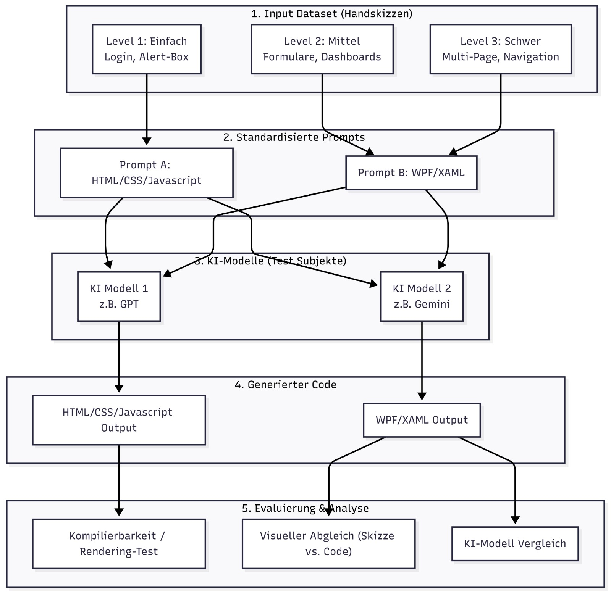

# Projekt-Proposal: Evaluierung von Vision-Language-Models im Sketch-to-Code Prototyping

---

## 1. Ziel des Projekts

### Übergeordnetes Ziel

Das übergeordnete Ziel dieses Projekts ist eine **empirische und vergleichende Analyse (Benchmarking)**, wie gut aktuelle multimodale KI-Modelle in der Lage sind, handgezeichnete UI-Skizzen in funktionalen Code zu übersetzen. Dabei untersuchen wir, wie sich die Qualität des generierten Codes in Abhängigkeit von zwei Hauptvariablen verändert:

1. **Ziel-Framework:** Web-Technologie (HTML/CSS/Javascript) vs. Desktop-Technologie (WPF/XAML)
2. **Komplexitätsgrad des Inputs:** Leicht (wenige Elemente), Mittel (Formulare), Schwer (Multi-Page Ansichten mit Navigation)

### Validierung des Erfolgs (Metriken)

Die Auswertung erfolgt wie folgt:

| Metrik | Beschreibung |
|---|---|
| **Syntaktische Korrektheit** | Lässt sich der WPF-Code ohne Fehler bauen? Rendert das HTML/CSS/Javascript fehlerfrei im Browser? |
| **Visuelle Treue (Visual Fidelity)** | Wie gut stimmen Layout-Strukturen und Positionierung der generierten UI mit der Originalskizze überein? |
| **Semantische Qualität** | KI-Vergleich, Nutzt die KI korrekte und moderne Framework-Konzepte (z. B. Semantic HTML, Flexbox/Grid bzw. WPF StackPanels und DataBindings), oder wird „Spaghetti-Code" generiert? |

---

## 2. System, Feature oder Workflow

Wir analysieren den **Design-to-Code Workflow**. Anstatt eine eigene Software zu entwickeln, etablieren wir einen methodischen Test-Workflow:

1. **Datensatz-Erstellung:** Erstellung eines standardisierten Sets an UI-Skizzen in den drei Komplexitätsstufen.
2. **Prompt-Standardisierung:** Entwicklung von  System-Prompts für HTML/CSS und WPF, um die KI-Modelle unter identischen Bedingungen zu testen.
3. **Manuelle Execution:** Die Skizzen und Prompts werden manuell an 2 verschiedene KI-Modelle (Gemini, ChatGPT) übergeben.
4. **Auswertung:** Systematische Kategorisierung und Bewertung der Outputs.

---

## 3. Beitrag der KI zum Entwicklungsprozess

In diesem Projekt ist die KI **nicht das Hilfsmittel** zur Entwicklung einer Software, sondern das **Untersuchungsobjekt selbst**. Wir analysieren den direkten Beitrag der KI zum Software-Engineering-Prozess (speziell in der Prototyping- und UI-Entwicklungsphase). Wir testen, inwieweit „AI-Assisted UI Engineering" heute schon praxistauglich ist.
Wir benutzen folgende KIs: Gemini, ChatGPT.

---

## 4. Analyse-Workflow

## 5. Projektplan (Task Breakdown)

Das Projekt wird in vier analytische Phasen unterteilt:

### Phase 1: Test-Design & Datensatz-Erstellung

- **Task 1.1:** Zeichnen der Skizzen für Level 1 (Leicht), Level 2 (Mittel) und Level 3 (Schwer).
- **Task 1.2:** Formulierung der Text-Prompts für WPF und HTML/CSS/Javascript (damit jedes Modell dieselben Anweisungen bekommt).

### Phase 2: Execution (Datenerhebung)

- **Task 2.1:** Manuelle Eingabe der Skizzen + HTML-Prompts in die ausgewählten KIs und Sichern der Ergebnisse.
- **Task 2.2:** Manuelle Eingabe der Skizzen + WPF-Prompts in die ausgewählten KIs und Sichern der Ergebnisse.

### Phase 3: Testing & Evaluierung

- **Task 3.1:** Auswertung des Web-Outputs (Rendern im Browser, Code-Inspektion).
- **Task 3.2:** Auswertung des Desktop-Outputs (in Visual Studio, Build-Tests).

### Phase 4: Analyse & Reporting

- **Task 4.1:** Zusammenführung der Testergebnisse.
- **Task 4.2:** Interpretation der Daten (Welches Modell gewinnt? Wo scheitern KIs bei WPF im Vergleich zu HTML?).
- **Task 4.3:** Erstellung der Abschlusspräsentation.

## 5. Teamwork und Responsibilities
| Mitglied | Aufgaben |
| :--- | :--- |
| **Ljundrim Ganiji** | Erstellung der Prompts, Durchführung der Prompts und Evaluierung der **HTML/CSS** Outputs, Zusammenführung der Testergebnisse, Präsentation erstellen |
| **Sajjad Ansari** | Erstellung der Skizzen, Durchführung der Prompts und Evaluierung der **WPF/XAML** Outputs, Zusammenführung der Testergebnisse, Präsentation erstellen |

